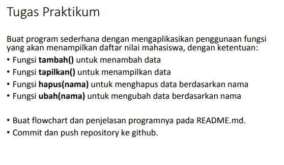
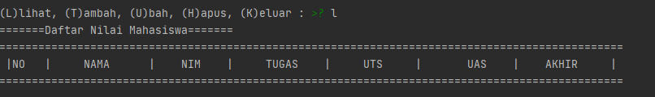
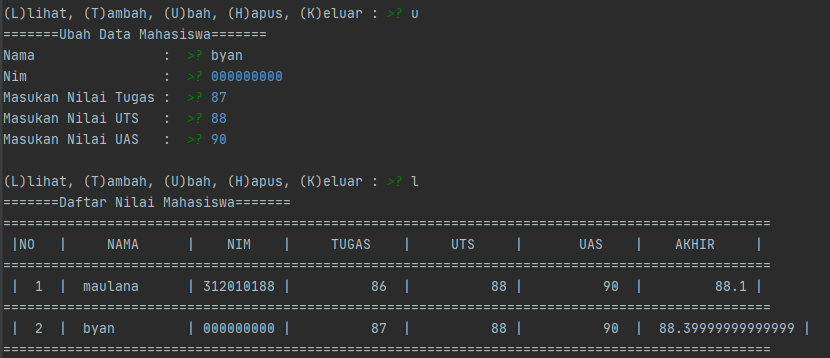
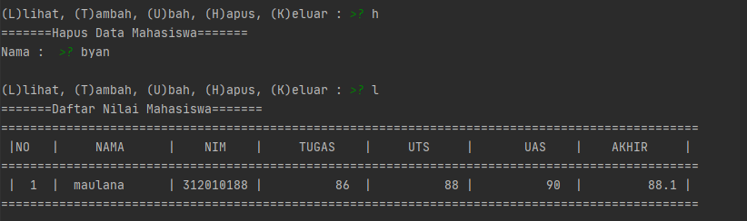

## Tugas 
Repository ini dibuat untuk memenuhi tugas Pertemuan 10 - Bahasa Pemrograman.
<hr>
Nama    : Maulana Muhamad <br>

NIM     : 312010188 <br>

Kelas   : TI.20. A.1 <br>
<hr>

## Pertemuan 10 - Lab 6

   

   # saya akan mencoba untuk menjabarkan fungsi dari tiap-tiap syntax beserta hasil outputnya:


### syntax dibawah berfungsi untuk melihat data :

```python
        elif c.lower() == 'l':
        print("=======Daftar Nilai Mahasiswa=======")
        print("================================================================================================")
        print(" |NO   |     NAMA      |    NIM    |     TUGAS    |     UTS     |       UAS    |    AKHIR     | ")
        print("================================================================================================")
        i = 0
        for x in data.items():
            i += 1
            print(
                " | {6:2}  |  {0:12s} | {1:9s} | {2:11}  | {3:11} | {4:11}  |  {5:11} |".format(x[0], x[1][0], x[1][1],
                                                                                                x[1][2], x[1][3],
                                                                                                x[1][4], i))
            print("================================================================================================")
```

> jika syntax diatas dirun yang nantinya berfungsi sepeti dibawah ini, masukan 
"L" untuk Melihat Data.



### syntax dibawah berfungsi untuk menambahkan data :

```python
       if c.lower() == 't':
        print("=======Tambah Data=======")
        nama = input("Nama                :  ")
        nim = input("Nim                 :  ")
        tugas = int(input("Masukan Nilai Tugas :  "))
        uts = int(input("Masukan Nilai UTS   :  "))
        uas = int(input("Masukan Nilai UAS   :  "))
        akhir = (0.30 * tugas) + (0.35 * uts) + (0.35 * uas)
        data[nama] = nim, tugas, uts, uas, akhir
```

> jika syntax diatas dirun yang nantinya berfungsi sepeti dibawah ini, masukan 
"T" untuk Menambah Data.


### syntax dibawah berfungsi untuk mengubah data :

```python
        elif c.lower() == 'u':
        print('=======Ubah Data Mahasiswa=======')
        nama = input('Nama                :  ')
        if nama in data.keys():
            nim = input('Nim                 :  ')
            tugas = int(input("Masukan Nilai Tugas :  "))
            uts = int(input("Masukan Nilai UTS   :  "))
            uas = int(input("Masukan Nilai UAS   :  "))
            akhir = (0.30 * tugas) + (0.35 * uts) + (0.35 * uas)
            data[nama] = nim, tugas, uts, uas, akhir
        else:
            print("Data Nilai Tidak Ada".format(nama))
```

> jika syntax diatas dirun yang nantinya berfungsi sepeti dibawah ini, masukan 
"U" untuk Mengubah Data.



### syntax dibawah berfungsi untuk menghapus data :


```python
            elif c.lower() == 'h':
        print("=======Hapus Data Mahasiswa=======")
        nama = input("Nama :  ")
        if nama in data.keys():
            del data[nama]
        else:
            print("Data Nilai Tidak Ada".format(nama))
```

> jika syntax diatas dirun yang nantinya berfungsi sepeti dibawah ini, masukan 
"H" untuk Menghapus Data.




<hr>

### Syntax dibawah ini adalah gabungan dari Syntax diatas dan ada yang ditambahkan untuk menghasilkan output Tambah Data, Ubah Data, Hapus Data,dan Tampilkan Data.

```python
data = []
data = {}

def tambah():
        print("=======Tambah Data=======")
        nama    =input("Nama                :  ")
        nim     =input("Nim                 :  ")
        tugas   =int(input("Masukan Nilai Tugas :  "))
        uts     =int(input("Masukan Nilai UTS   :  "))
        uas     =int(input("Masukan Nilai UAS   :  "))
        akhir   = (0.30 * tugas) + (0.35 * uts) + (0.35 * uas)
        data[nama] = nim ,tugas, uts, uas, akhir

def lihat():
    if data.items():
        print("=======Daftar Nilai Mahasiswa=======")
        print("================================================================================================")
        print(" |NO   |     NAMA      |    NIM    |     TUGAS    |     UTS     |       UAS    |    AKHIR     | ")
        print("================================================================================================")
        i=0
        for x in data.items():
            i+=1
            print(" | {6:2}  |  {0:12s} | {1:9s} | {2:11}  | {3:11} | {4:11}  |  {5:11} |".format(x[0], x[1][0], x[1][1], x[1][2], x[1][3], x[1][4], i))
            print("============================================================================================")
    else:
        print("=======Daftar Nilai Mahasiswa======")
        print("================================================================================================")
        print(" |NO   |     NAMA      |    NIM    |     TUGAS    |     UTS     |       UAS    |    AKHIR     | ")
        print("================================================================================================")
        print("|                                      TIDAK ADA DATA                                         |")
        print("===============================================================================================")

def ubah():
        print('=======Ubah Data Mahasiswa=======')
        nama = input('Nama                :  ')
        if nama in data.keys():
            nim     =input('Nim                 :  ')
            tugas   =int(input("Masukan Nilai Tugas :  "))
            uts     =int(input("Masukan Nilai UTS   :  "))
            uas     =int(input("Masukan Nilai UAS   :  "))
            akhir   =(0.30 * tugas) + (0.35 * uts) + (0.35 * uas)
            data[nama] = nim, tugas, uts, uas, akhir
        else:
            print("Data Nilai Tidak Ada".format(nama))

def hapus():
        print("=======Hapus Data Mahasiswa=======")
        nama=input("Nama :  ")
        if nama in data.keys():
            del data[nama]
        else:
            print("Data Nilai Tidak Ada".format(nama))


print("PROGRAM MENAMPILKAN DAFATR NILAI MAHASISWA")
while True:
    print("")
    c =input("(L)lihat, (T)ambah, (U)bah, (H)apus, (K)eluar : ")
    if c.lower() == 't':
        print("=======Tambah Data=======")
        nama = input("Nama                :  ")
        nim = input("Nim                 :  ")
        tugas = int(input("Masukan Nilai Tugas :  "))
        uts = int(input("Masukan Nilai UTS   :  "))
        uas = int(input("Masukan Nilai UAS   :  "))
        akhir = (0.30 * tugas) + (0.35 * uts) + (0.35 * uas)
        data[nama] = nim, tugas, uts, uas, akhir
    elif c.lower() == 'u':
        print('=======Ubah Data Mahasiswa=======')
        nama = input('Nama                :  ')
        if nama in data.keys():
            nim = input('Nim                 :  ')
            tugas = int(input("Masukan Nilai Tugas :  "))
            uts = int(input("Masukan Nilai UTS   :  "))
            uas = int(input("Masukan Nilai UAS   :  "))
            akhir = (0.30 * tugas) + (0.35 * uts) + (0.35 * uas)
            data[nama] = nim, tugas, uts, uas, akhir
        else:
            print("Data Nilai Tidak Ada".format(nama))

    elif c.lower() == 'l':
        print("=======Daftar Nilai Mahasiswa=======")
        print("================================================================================================")
        print(" |NO   |     NAMA      |    NIM    |     TUGAS    |     UTS     |       UAS    |    AKHIR     | ")
        print("================================================================================================")
        i = 0
        for x in data.items():
            i += 1
            print(
                " | {6:2}  |  {0:12s} | {1:9s} | {2:11}  | {3:11} | {4:11}  |  {5:11} |".format(x[0], x[1][0], x[1][1],
                                                                                                x[1][2], x[1][3],
                                                                                                x[1][4], i))
            print("================================================================================================")

    elif c.lower() == 'h':
        print("=======Hapus Data Mahasiswa=======")
        nama = input("Nama :  ")
        if nama in data.keys():
            del data[nama]
        else:
            print("Data Nilai Tidak Ada".format(nama))

    elif c.lower() == 'k':
        print("Keluar")
        break
```

### Sekian hanya ini yang dapat saya sampaikan, semoga bermanfaat.
## TERIMAKASIH